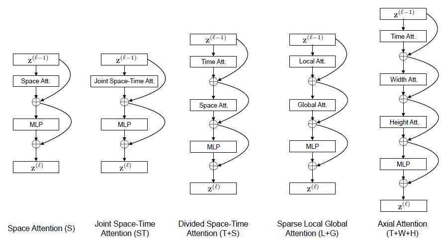

# TimeSformer
This repository contains the project developed for the Artificial Vision course. This project analyzes [TimeSformer](https://github.com/facebookresearch/TimeSformer) model and tests its performances in video action recognition on [UCF11 Youtube
Action Data Set](https://www.crcv.ucf.edu/data/UCF_YouTube_Action.php) and [UCF101](https://www.crcv.ucf.edu/data/UCF101.php).\
The considered TimeSformer models are <i>Joint Space-Time Attention</i>, <i>Divided Space-Time Attention</i>, <i>Space only Attention</i>.
An overview of the project can be found in <i>
TimeSformer.pdf</i>.

### Preprocessing
The preprocessing phase on UCF11 and UCF101 is described in <i>UCF11_Preprocessing.ipynb</i> and  <i>UCF101_Preprocessing.ipynb</i>.

### Training
The training has been performed using 85% of the dataset as training set and 15% as test set; a k-fold cross validation (k=5) was employed. The maximum number of epochs was set to 7 and a single GPU was used.

### Results
The results of the experiments on the two datasets can be found in <i>Output_UCF11</i> and <i>Output_UCF101</i>; for each model and dataset the mean and standard deviation of the top5 and top1 classification results was considered.
